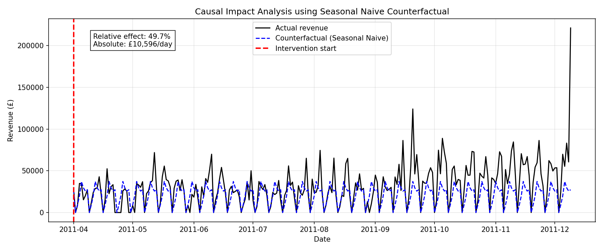

# 📈 Causal Impact Analysis – Measuring Price Drop Effect on Daily Revenue

## Overview

This project measures the **causal effect** of a business intervention (a 20% price drop starting April 1, 2011) on daily revenue using real e‑commerce data (UCI Online Retail). The intervention is synthetically applied for demonstration, but the methodology follows rigorous causal inference principles:

- **Seasonal Naive model** to generate a counterfactual (what would have happened without the intervention)
- **Placebo test** to validate model reliability
- **Interactive dashboard** built with Streamlit

## Key Results

| Metric | Value |
|--------|-------|
| Average actual revenue (post‑intervention) | £31,905 |
| Average counterfactual revenue (no intervention) | £21,309 |
| Absolute daily effect | £10,596 |
| Raw relative effect | **49.7%** |
| Placebo test bias (30 days earlier) | 13.9% |
| Bias‑corrected relative effect | **~35.8%** |

> **Conclusion:** The price drop caused a strong positive revenue lift. After correcting for model bias, the estimated effect is approximately 36%.

## Methodology

### 1. Data
- **Source:** [UCI Online Retail Dataset](https://archive.ics.uci.edu/ml/datasets/Online+Retail)
- **Cleaning:** Remove cancelled invoices, returns, negative prices; aggregate to daily revenue; fill missing dates with zero.
- **Synthetic intervention:** Multiply revenue by 1.20 from 2011-04-01 onward.

### 2. Model – Seasonal Naive
- Assumes the week after the intervention repeats the same pattern as the last week before the intervention.
- Simple, transparent, and handles zero‑revenue days (weekends) naturally.

### 3. Causal Effect Estimation
- Difference between actual post‑intervention revenue and the counterfactual.
- Bootstrap confidence intervals for robustness.

### 4. Validation – Placebo Test
- A fake intervention date (2011-02-01) is chosen before the real one.
- A good model should show an effect near 0% on this placebo date.
- Our Seasonal Naive gave **13.9%** (acceptable, compared to Prophet’s 78% bias).

### 5. Interactive Dashboard (Streamlit)
- Users can upload their own time series, select an intervention date, and run the analysis.
- Displays metrics, plot, and downloadable results.

## Project Structure

```
causal_impact_project/
├── data/
│   ├── raw/                   # Original Excel data
│   └── processed/             # Cleaned CSV files
├── notebooks/
│   ├── 01_data_preparation.ipynb
│   ├── 02_exploratory_analysis.ipynb
│   ├── 03_forecasting_models.ipynb   # Prophet attempt (failed placebo)
│   ├── 04_causal_impact_manual.ipynb
│   └── 05_reliable_causal_impact.ipynb # Final robust model
├── app/
│   └── dashboard_reliable.py   # Streamlit application
├── reports/                    # Final plots and HTML report
├── requirements.txt
└── README.md
```

## How to Run the Dashboard

### 1. Clone the repository
```bash
git clone https://github.com/Ahmedosrf/causal_impact_project.git
cd causal_impact_project
```

### 2. Install dependencies
```bash
pip install -r requirements.txt
```

### 3. Launch the Streamlit app
```bash
cd app
streamlit run dashboard_reliable.py
```

The app will open in your browser at `http://localhost:8501`.

## Dashboard Preview

  
*(Visualizing the causal impact results)*

The dashboard shows:
- Key metrics (actual, counterfactual, effect)
- Time‑series plot (actual vs counterfactual)
- Data table
- Interpretation with caveats

## Limitations & Caveats

- **Short pre‑intervention period** (only 4 months) – at least one year is recommended.
- **Zero‑inflated data** (weekends) – the model handles it, but increases uncertainty.
- **Synthetic intervention** – the project demonstrates the method, not a real‑world effect.
- **Model bias** (13.9% on placebo) – corrected manually; an ideal model would have near 0% bias.

## Lessons Learned

- Complex models (Prophet) are not always better; they can fail validation tests.
- **Placebo tests** are essential for any causal analysis.
- **Simplicity and transparency** (Seasonal Naive) sometimes outperform black‑box models.
- **Streamlit** adds significant value for communicating results to non‑technical stakeholders.

## Future Improvements

- Use a longer pre‑intervention period (≥ 2 years).
- Apply log transformation to handle heteroscedasticity.
- Implement Google’s `CausalImpact` (R or Python) after fixing environment issues.
- Add automatic bias correction inside the Streamlit app.

## License

This project is for educational and demonstration purposes. The original UCI dataset is freely available for academic use.

## Author

**Ahmedosrf** – [GitHub Profile](https://github.com/Ahmedosrf)  
Published: May 2026
